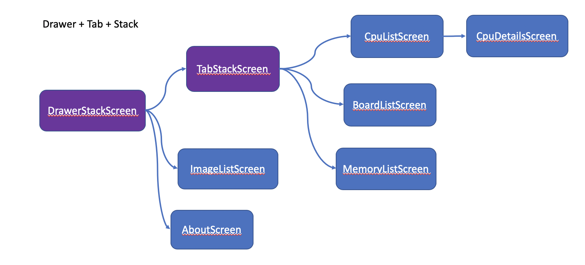

# react-native-navigation-examples

- drawer-tab-direct access 코딩 시작

### 샘플1 : 탭 화면 구성하기


유튜브 라이브 코딩 : https://www.youtube.com/watch?v=KL2SpTY9pl4

### 샘플2 : Drawer 화면 구성하기


유튜브 라이브 코딩 : https://www.youtube.com/watch?v=uInH2jToLp0

### 샘플3 : Drawer + 탭 화면 구성하기 (1)


유튜브 라이브 코딩 : https://www.youtube.com/watch?v=W3o1kjBxX

### 샘플4 : Drawer + 탭 화면 구성하기 (2)


유튜브 라이브 코딩 : https://www.youtube.com/watch?v=Zv43p61vrsY

### 샘플5 : Drawer + 탭 화면 구성하기 (3)


유튜브 라이브 코딩 : https://www.youtube.com/watch?v=pd01LyE7ts8&t=13s

### 코딩에 사용한 javascript snippet

```
{
	"Screen Page": {
		"prefix": "spscreen",
		"body": [
			"import React from \"react\";",
			"import { View, Text } from \"react-native\";",
			"",
			"const ${1}Screen = () => {",
			"	return (",
			"		<View>",
			"			<Text> ${1}Screen </Text>",
			"		</View>",
			"	);",
			"};",
			"",
			"export default ${1}Screen;"
		],
		"description": "React Native 스크린 페이지"
	},
	"Stack Page": {
		"prefix": "spstack",
		"body": [
			"const ${1}Stack = createStackNavigator();",
			"const ${1}StackScreen = ({ navigation }) => {",
				"	return (",
				"		<${1}Stack.Navigator>",
				"			 <${1}Stack.Screen name=\"\" component={} options={{}} />",
				"	  </${1}Stack.Navigator>",
				"	);",
			"};",
		],
		"description": "스택 스크린"
	}
}
```
